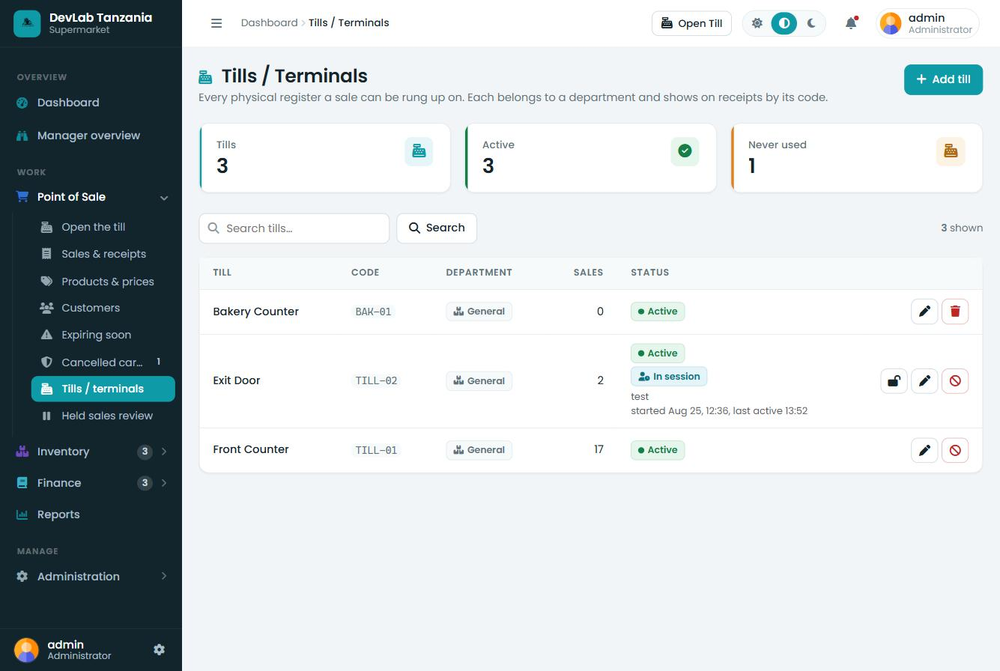
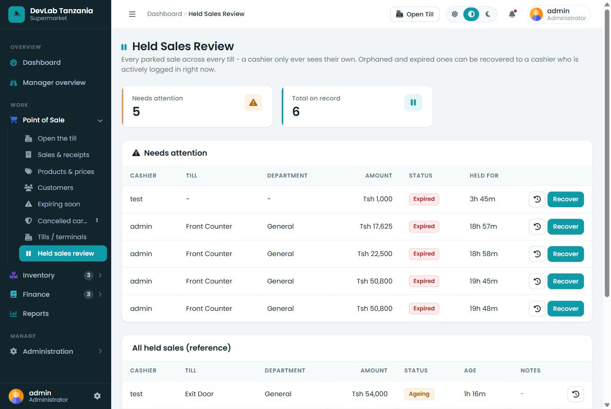

# USER GUIDE

| | |
|---|---|
| **System Name** | OmniBiz — a configurable retail Point of Sale, Inventory and Accounting system |
| **Document Title** | User Guide |
| **Version** | 1.0 |
| **Date** | 13 August 2026 |
| **Prepared From** | Direct inspection of the application source code and the running application at `http://localhost:8081/Home/` |
| **Application Version** | Not defined in the application. (There is no version constant anywhere in the codebase. The database schemas carry their own version numbers — inventory v4, catalog v2, accounting v3, POS v3, core v2 — but the application itself does not.) |

> **How to read this guide.** Every screen, button and message described here was read from the source code or seen in the running system. Where something does not exist, this guide says so explicitly rather than describing what it "should" do.

---

## Table of contents

1. [Introduction](#1-introduction)
2. [Getting started](#2-getting-started)
3. [Understanding user roles](#3-understanding-user-roles)
4. [Dashboard](#4-dashboard)
5. [POS / Sales](#5-pos--sales)
6. [Inventory](#6-inventory)
7. [Product management](#7-product-management)
8. [Purchasing](#8-purchasing)
9. [Accounting](#9-accounting)
10. [Customers](#10-customers)
11. [Users and access](#11-users-and-access)
12. [Profile](#12-profile)
12S. [Setting up the shop](#12s-setting-up-the-shop)
12T. [Departments](#12t-departments)
12A. [Shop Settings](#12a-shop-settings)
12B. [Choosing light or dark](#12b-choosing-light-or-dark)
12C. [POS full screen and the customer display](#12c-pos-full-screen-and-the-customer-display)
12D. [Reports](#12d-reports)
12E. [Tills / Terminals](#12e-tills--terminals)
12F. [Held Sales Review](#12f-held-sales-review)
13. [Notifications and alerts](#13-notifications-and-alerts)
14. [Common problems](#14-common-problems)

---

## 1. Introduction

### What the system is

OmniBiz is a **retail management system**. It runs on a computer in the shop and is used through a web browser. It is not a public website — only members of staff sign in, and there is no customer login of any kind.

It is not built for one kind of shop. A supermarket, a stationery shop, a duka la dawa, a hardware shop or a cosmetics counter all run the same program; an administrator describes the business once in [Setup](#12s-setting-up-the-shop), and the system organises itself around that. This guide's examples come from the shop it was written in — a supermarket and stationery store — but wherever it says "Supermarket" or "Stationery" your own departments appear instead.

### What it is used for

The system covers four connected areas of the business:

| Area | What it does |
|---|---|
| **Point of Sale (POS)** | Ringing up walk-in customers at the till, taking payment, printing receipts |
| **Inventory** | Tracking what stock is on hand, what it cost, and every movement in and out |
| **Purchasing** | Raising purchase orders to suppliers, receiving deliveries and recording payments |
| **Accounting** | A full double-entry ledger that records every sale, expense and stock movement automatically |

The four are joined together. A single sale at the till simultaneously reduces stock, records the takings, calculates profit and writes the accounting entry — all at once, and all in one step that either fully succeeds or fully fails.

### Main business functions

- Sell products at the till by scanning a barcode or tapping the product on screen
- Accept payment in cash, mobile money (Lipa Namba), bank transfer or card — including several at once on one sale
- Print an 80 mm thermal receipt
- Hold a sale part-way through and come back to it
- Track stock levels, minimum levels and reorder points across whatever departments the shop has set up
- Receive stock by scanning it in, or against a purchase order
- Record damage, expiry, loss and stock counts
- Raise purchase orders, receive goods against them and record supplier payments
- Record shop expenses
- Close the day (Z-Report) by counting the drawer against what the system expected
- Produce a Profit & Loss statement, a trial balance and a set of inventory reports

### Who uses it

Four kinds of staff, described in full in [section 3](#3-understanding-user-roles):

- **Cashiers** — work the till
- **Storekeepers** — look after stock and purchasing
- **Managers** — oversee sales, stock and the books
- **Administrators** — everything, plus user accounts, departments and how the shop itself is set up

---

## 2. Getting started

### How to access the system

Open a web browser on a computer connected to the shop network and go to:

```
http://localhost:8081/Home/
```

If you are on another computer in the shop, replace `localhost` with the shop server's address, for example `http://192.168.0.100:8081/Home/`.

The address on its own takes you straight to the sign-in page.

### Login


1. The sign-in page shows **OmniBiz — Supermarket & Stationery · Point of Sale**.
2. Type your **Username**.
3. Type your **Password**. The eye icon at the right of the password box shows what you have typed, if you need to check it.
4. Optionally tick **Keep me signed in on this till**.
5. Click **Sign in**.

You are taken straight to your own home screen — there is no menu to choose from. Where you land depends on your role:

| Role | Lands on | Address |
|---|---|---|
| Administrator | Dashboard | `/admin/dashboard` |
| Manager | Manager Overview | `/manager/overview` |
| Storekeeper | Inventory Dashboard | `/inventory` |
| Cashier | POS Terminal | `/pos/terminal` |

**About "Keep me signed in on this till".** Ticking this box remembers this browser for 30 days, so you are signed back in without typing your password. It is convenient on a dedicated till, but it means anyone who uses that computer is signed in as you. **Do not tick it on a shared or office computer.**

What it does *not* do: it cannot be copied to another computer and reused — the system detects that and signs the account out everywhere, so you would have to sign in with your password again. Signing out, changing your password, having your role changed, or having your account deactivated all cancel it immediately.

### Logout

In the **Account** section at the bottom of the sidebar, click **Sign out** (the arrow icon). A confirmation appears — *"You will need to sign in again to continue."* — click **Sign out** again to confirm.

Logging out clears your session and removes the "keep me signed in" cookie.

**At the till**, there is no sidebar. Sign out is in the **top bar**, at the right. It asks you to confirm first, because anything still in the cart is lost.

*(The gear icon beside your name and role at the very bottom of the sidebar opens your Profile, not sign-out.)*

### Navigation

Every screen except the POS terminal shares the same layout:

- **Left sidebar** — the menu, under five headings: **Overview**, **Sell**, **Stock**, **Finance** and **Account**. Within them are the collapsible groups *Sales*, *Inventory*, *Accounting* and *Account*. You only see what your role is allowed to use.
- **Top bar** — the page title and breadcrumb trail, an **Open Till** button, a notification bell, and your name and role.
- **Main area** — the page itself.

Sidebar sections expand and collapse when you click them, and the system remembers which ones you had open.

### User profile

Click **Profile** in the *Account* section of the sidebar. See [section 12](#12-profile).

---

## 3. Understanding user roles

*(Updated 25 August 2026 — a fifth role, Accountant, was added, and several permissions were split or newly enforced. See the notes under the matrix for exactly what changed.)*

The system has exactly **five roles**. There is no facility to create new roles or to edit which modules a role can reach — the five roles and their permissions are fixed in the program.

### Administrator (`admin`)

The full system, with no restrictions. Only an administrator can:

- Open the **Chart of Accounts** and add, edit or deactivate ledger accounts
- Post **manual journal entries** and reverse posted entries
- Open the **Departments** screen to add, rename, reorder, disable or remove a department
- Run **Setup** to describe the business

*(Departments are administrator-only on purpose: they decide how the whole shop is organised, and switching one off takes its entire product range off the till — a decision about what the business sells rather than a day-to-day one.)*

> **Approving spending.** Only administrators and managers can **approve a purchase order**, **cancel one that has already been approved**, or **record a payment to a supplier**. A storekeeper raises the order, attaches the invoice and books the goods in when they arrive — the money decisions stay with a supervisor.

### Manager (`manager`)

Everything operational, plus reports and overrides. A manager can do everything an administrator can **except**:

- Open the Chart of Accounts
- Post or reverse journal entries
- Open the Departments screen

A manager **can** void sales, manage users, approve stock requests, manage tills/terminals (including force-releasing a stuck one), review and recover held sales, and see all accounting reports.

### Accountant (`accountant`)

*New 25 August 2026.* The books, full stop — Chart of Accounts, General Ledger, Expenses, Profit & Loss, the daily close history, plus **read-only** Sales Reports to reconcile revenue against what was posted. An accountant **cannot** open the POS Terminal, see or touch inventory, approve or pay a purchase order, manage tills, or manage users — and does not see the operational (own-till) sales list a cashier uses, since that's a different screen from the Sales Reports group.

### Storekeeper (`storekeeper`)

Stock and purchasing only. A storekeeper can reach Products, Inventory, Purchasing, the Barcode Station, Stock Requests, Expiring Soon, and can see (but not pay) Supplier Liabilities. A storekeeper **cannot** open the till, see sales, see customers, see any accounting, approve a purchase order or pay a supplier, or manage users.

### Cashier (`cashier`)

The till and nothing else. A cashier can use the POS Terminal, see their **own** sales and receipts, raise a Stock Request, and see Expiring Soon. A cashier **cannot** see inventory, products, purchasing, accounting, reports, tills/terminals management, another cashier's held sales, or user management — and cannot void a sale. *(25 August 2026: a cashier no longer has a separate Customer Management screen — the till's own phone lookup at checkout still works — and is locked to one till per login; switching tills requires logging out and back in.)*

### Role / permission matrix

A tick means the role has that permission. These come directly from `roleModules()` in the program.

| Permission (module) | What it controls | Admin | Manager | Accountant | Storekeeper | Cashier |
|---|---|:--:|:--:|:--:|:--:|:--:|
| `dashboard` | Main Dashboard | ✔ | ✔ | ✔ | — | — |
| `manager_overview` | Manager Overview screen | ✔ | ✔ | — | — | — |
| `pos` | POS Terminal | ✔ | ✔ | — | — | ✔ |
| `pos_sales` | Own-till Sales & Receipts list, receipt reprint | ✔ | ✔ | — | — | ✔ |
| `pos_void` | Void a sale | ✔ | ✔ | — | — | — |
| `products` | Products & Prices | ✔ | ✔ | — | ✔ | — |
| `inventory` | Inventory: items, movements, categories, units, reports, disposal | ✔ | ✔ | — | ✔ | — |
| `purchasing` | Raise purchase orders, receive goods | ✔ | ✔ | — | ✔ | — |
| `purchasing_approve` | Approve/cancel a PO, pay a supplier | ✔ | ✔ | — | — | — |
| `barcode` | Barcode Station and label printing | ✔ | ✔ | — | ✔ | — |
| `stock_requests` | Raise/approve stock requests | ✔ | ✔ | — | ✔ | ✔ |
| `customers` | Customer management screen | ✔ | ✔ | — | — | — |
| `accounting` | Accounting overview, ledger, expenses, P&L, Z-report | ✔ | ✔ | ✔ | — | — |
| `accounting_manage` | Chart of accounts, manual journal entries, reversals | ✔ | — | ✔ | — | — |
| `sales_reports` | Shop-wide Sales report group (summary/by-cashier/by-terminal) | ✔ | ✔ | ✔ | — | — |
| `users` | Manage Users | ✔ | ✔ | — | — | — |
| `settings` | Inventory Settings | ✔ | ✔ | — | — | — |
| `departments` | Enable/disable departments | ✔ | — | — | — | — |
| `shop_settings` | Shop identity, receipt, payment methods | ✔ | — | — | — | — |
| `disposal_approve` | Approve a stock disposal/write-off | ✔ | ✔ | — | — | — |
| `expiry_alerts` | Expiring Soon screen | ✔ | ✔ | — | ✔ | ✔ |
| `supplier_liabilities` | Supplier balances (storekeeper: read-only, enforced by the page) | ✔ | ✔ | — | ✔ | — |
| `fraud_audit` | Cancelled Carts report | ✔ | ✔ | — | — | — |
| `terminals` | Tills / Terminals management, Force Release | ✔ | ✔ | — | — | — |
| `held_sales_review` | Held Sales Review — recover an orphaned/expired held sale | ✔ | ✔ | — | — | — |

**Notes on this table (verified from source code, 25 August 2026):**

- **`pos_void`** is now genuinely checked (`userCan('pos_void')`) on the Sales & Receipts screen — it used to test the role name directly instead, which had the same practical effect but meant the permission listed here wasn't actually what was tested. That drift is fixed.
- The old **`reports`** permission (granted to admin/manager but checked nowhere — Inventory Reports has always actually gated on `inventory`) was **removed from the system entirely** on 25 August 2026, rather than left as dead weight.
- **Inventory Settings** and **Manage Users** check the role names `admin` and `manager` directly rather than the `settings` / `users` permissions.
- A cashier viewing a receipt must be that sale's own cashier (or an admin/manager) — enforced on the page itself, not by a separate permission.
- Pages that everyone signed in can reach: **Dashboard entry point** (`admin/index.php` — it redirects roles without dashboard access to their own home screen), **Profile**, and **Access denied**.

---

## 4. Dashboard


The Dashboard is the administrator's and manager's landing screen. It shows the whole shop at a glance for today.

### KPI cards (the four boxes across the top)

| Card | What it means |
|---|---|
| **Today's Takings** | The total value of completed sales today, and how many sales that was. Voided sales are excluded. |
| **Today's Gross Profit** | Takings less what those goods cost you (at weighted-average cost). The smaller line shows the cost. |
| **Expected in Drawer** | How much cash the system believes is in the till right now — opening float, plus cash sales, less change given and less any cash expenses. The smaller line splits it between cash and mobile money. |
| **Needs Reordering** | How many products are at or below their reorder level, split into "out" (zero stock) and "low". |

### Last 7 Days

A bar chart of daily takings for the past week, with **Month to date** and **average basket** shown alongside.

### Today by Department

Today's takings split between **Supermarket**, **Stationery** and **General**, with a progress bar for each. Below that:

- **Stock on hand (at cost)** — the total value of everything on your shelves, valued at what you paid
- **Active items** — how many products are set up and active
- **Open purchase orders** — orders raised but not yet fully received

### Top Sellers This Month

The best-selling products this month by revenue, with the department, quantity sold and revenue.

### Reorder Now

Products at or below their reorder level, with current stock and the level that triggered it. **View all** opens the full Inventory Items list. When nothing needs reordering it reads *"Every item is above its reorder level."*

### Manager Overview

Managers have a separate landing screen, **Manager Overview** (`/manager/overview`), reachable from the sidebar. It is deliberately read-only and covers sales performance, daily summaries, cashier and terminal performance, inventory positions and the profit position — the figures a manager checks before deciding what to override.

---

## 5. POS / Sales


The POS terminal is a full-screen till. It deliberately has no sidebar — everything a cashier needs is on this one screen.

**Layout:**

- **Top bar** — the terminal name, the scan box, today's running total for you, **Sales & receipts**, the customer-screen and full-screen buttons, and **Sign out**. *(Managers and administrators also get **Exit POS**, which returns them to their own home screen. A cashier has no other screen, so they see Sign out only.)*
- **Left** — department tabs, category tabs, and the product grid
- **Right** — the current sale: cart, discount, total, payment, and the action buttons

### Starting a sale

There is nothing to start. The till is always ready — scan or tap the first product and the sale begins.

### Selecting a terminal

*(Behaviour changed 25 August 2026 — a terminal is now a real, single-holder lock, not just a remembered preference.)*

Right after logging in, if you don't already hold a till, you're shown **Select a Till** — a list of every till, each marked **Available**, **In use by &lt;name&gt;**, or **Stale — reclaimable** (someone was on it but stopped responding). Pick an available one. You cannot proceed to the checkout screen until you do — there is no more automatic fallback to "the first active till."

The till you pick is named in the top bar (in the screenshot, **Supermarket Counter (SM-01)**) for the rest of this login, but it is **no longer clickable** — there is nothing to switch to from here. **To use a different till, log out and log back in** and pick the other one from the same list. This is deliberate: one cashier can never be on two tills at once, and a till you're actively using cannot be taken by someone else while you're on it.

If your session goes quiet for too long (network drop, laptop asleep) your lock can go stale and you may be asked to pick a till again — your cart-in-progress is not affected, and any sales you'd already held are safe regardless (see "Resuming a held sale" below).

A till belongs to a department, and opens showing that department's stock — a till set to Supermarket opens on supermarket stock, one set to Plumbing opens on plumbing stock. A till set to **General**, or to no department at all, opens showing **everything**. You can switch department by tab at any time, and **All Departments** is always the first tab.

### Searching for a product

Type any part of the name, SKU, barcode or brand into the scan box at the top. The grid filters as you type. Clear the box to see everything again.

### Selecting a department

Click one of the tabs above the grid. **All Departments** is always first, then one tab for each department this shop has set up - whatever they are called here.

Only departments that are currently trading appear. If an administrator has switched a department off, its tab disappears and its products are gone from the grid entirely.

### Selecting a category

Below the department tabs is a row of category chips — **All Products**, then each category (Baby Products, Bakery, Beverages, Cooking Oil & Spices, Dairy & Eggs, Dry Goods…). Click one to narrow the grid. The chips shown are only those that actually have products on the grid.

### Scanning a barcode

**Just scan.** You do not have to click into the scan box first. A hardware USB or Bluetooth scanner works anywhere on the page — the till recognises the fast burst of keystrokes a scanner produces and handles it as a scan.

- If the product is already on the grid, it is added instantly.
- If it is not on the grid, the till looks it up on the server.
- A successful scan **beeps** and shows a green message: *"Added &lt;product name&gt;"*.
- A failed scan gives a different, lower beep and a red message explaining why.

**Press F2 at any time to jump back to the scan box.** This works from anywhere on the till.

Typing slowly by hand does not trigger the scanner behaviour — you can type a code into the scan box and press Enter instead.

### Adding products

Either **tap the product card** in the grid, or scan it. The number in the top-right corner of each card is the stock on hand.

### Changing quantity

Each line in the cart has **−** and **+** buttons, and the quantity between them can be typed into directly.

The till will not let you go above the stock on hand.

### Removing products

Set the quantity to 0, or use the remove control on the cart line. **Clear Cart** empties the whole cart — it asks *"Clear the whole cart?"* first.

### Applying discounts

There is one discount box, labelled **Discount**, above the total. It takes a shilling amount (not a percentage) off the whole sale. The discount is capped at the subtotal — you cannot discount a sale below zero.

*Per-line discounts exist in the system's data and are accepted by the checkout, but the till screen does not offer a way to enter one. **Not implemented in the user interface.***

### Customer selection

Above the cart is a dropdown that starts on **Walk-in (cash)**. Change it to the registered-customer option and two boxes appear for the customer's **name** and **phone number**.

The phone number is the customer's identity. If that number is already known, the sale is attached to the existing customer; if not, a customer record is created automatically. Customers never have a login.

### Selecting payment method

Four methods exist:

| Method | Label on screen | Notes |
|---|---|---|
| Cash | **Cash** | The only method that can give change |
| Mobile money | **Lipa Namba/Mobile** | Tigo Pesa / Mixx by Yas |
| Bank transfer | **Bank transfer** | Hidden until you click **Split** |
| Card | **Card** | Hidden until you click **Split** |

Cash and Lipa Namba/Mobile are always visible. Click the **Split** button next to *Payment* to reveal Bank transfer and Card.

**A sale can be settled with more than one method at once** — cash + Lipa Namba, Lipa Namba + bank, and so on. Type an amount into each box you are using. The **Tendered** and **Balance due** lines update as you type.

#### Cash payment

Type the amount into the **Cash** box, or use the quick-tender buttons:

- **Exact** — fills in exactly what is still owed after any other methods
- **1,000 / 2,000 / 5,000 / 10,000 / 20,000 / 50,000** — adds that note to the cash box
- **Clear** — empties the cash box

**Change due** is shown in the green box and can only ever come out of cash.

#### Lipa Namba

Type the amount received into the **Lipa Namba/Mobile** box. The shop's Lipa Namba details are held in the system (number, provider and registered name, configured in Shop Settings).

#### Card

Click **Split** to reveal the **Card** box, then type the amount.

**Important rule for all non-cash methods:** the electronic amount must never be more than the total. Change can only be given from the cash drawer, so if you enter more than is owed the till refuses with *"Electronic payment is more than the total — change can only be given in cash."*

### Completing a sale

Click **Complete & Print Receipt**.

The button greys out and shows *"Processing…"* while the sale is saved. Before it sends anything, the till checks:

- that something has been entered as payment — otherwise *"Enter how the customer is paying."*
- that no electronic method exceeds the total
- that the total tendered covers the sale — otherwise *"Short by Tsh &lt;amount&gt;."*

The server then checks everything again independently. **Prices are always recalculated on the server** — whatever the screen displayed, the amount charged comes from the database.

On success you get a beep, a message *"Sale &lt;receipt number&gt; complete."* (plus the change, if any), the receipt window opens, and the till clears itself for the next customer. Receipt numbers look like `MRT-20260813-001A7K`.

### Printing a receipt

The receipt opens automatically in a small window and is laid out for an 80 mm thermal printer. It shows the shop name and address, the receipt number, date and time, the cashier, the customer if one was attached, every line with quantity and price, the subtotal, discount, tax if any, the total, each payment method used, the change, and the footer message *"Thank you for shopping with us!"*

To reprint an old receipt, go to **Sales & Receipts** in the sidebar and use the reprint action on that sale.

> **If your browser blocks the receipt window,** allow pop-ups for this site. The sale is already saved — nothing is lost.

### Holding a sale

Click **Hold Sale**. A dialog on the page (not a browser pop-up, since 25 August 2026) asks for a label — it suggests *"Held HH:MM"*, but a customer's name is more useful. The cart is saved on the server and your cart clears for the next customer.

*(Behaviour changed 25 August 2026.)* A held sale belongs to **you, on the till you held it on** — no other cashier can see it, resume it, or discard it, even on a different till. It is never lost: if you log out before finishing it, it waits for you rather than disappearing or being deleted (see "What happens if I log out with a sale still held?" below).

*"Nothing to hold."* means the cart is empty.

### Resuming a held sale

Open the held-sales list from the till — it only ever shows **your own** held sales on **this** till. Find the sale by its label and choose **Resume**. The cart is restored and you get *"Held sale resumed."* When you complete that sale, the held record is marked completed — it is **not deleted**; a manager can still see it in the shop's history.

You can also discard a held sale without selling it — you'll be asked for a reason, same as clearing an in-progress cart.

### What happens if I log out with a sale still held?

*(New 25 August 2026.)* Nothing is lost and nothing is deleted. If you log back in yourself — even on a different day — and pick a till, that sale comes back to your held-sales list automatically. **No one else can pick it up in the meantime**, even if they use the same till while you're away. If you genuinely need someone else to finish it (you're off for the day, for example), ask a manager or administrator — they can review it and hand it to whoever is actively on shift, on the **Held Sales Review** screen.

### Handling an invalid barcode

The till beeps low and shows: **"No product matches barcode &lt;code&gt;."**

What to do:

1. Check the barcode is not damaged and rescan.
2. Search for the product by name in the scan box instead.
3. If the product genuinely has no barcode, a storekeeper can assign one on the **Barcode Station** screen (Assign Barcodes tab).

### Handling out-of-stock products

Scanning something with no stock gives: **"&lt;product&gt;: Out of stock."**

If you try to add more than there is, the till stops you at the available quantity. The server checks again at checkout and refuses with *"Not enough stock for &lt;product&gt;. Available: &lt;qty&gt;."*

Two other refusals you may see when scanning:

- **"This item is not set up for sale (check Products & Prices)."** — the product exists in inventory but has not been made sellable.
- **"The &lt;department&gt; department is not currently trading."** — an administrator has switched that department off.

### Handling insufficient payment

The till refuses to complete and shows **"Short by Tsh &lt;amount&gt;."** Add more to one of the payment boxes. Nothing has been saved and no stock has moved.

### Keyboard shortcuts

| Key | What it does |
|---|---|
| **F2** | Jump to the scan box from anywhere on the till |
| **Enter** | In the scan box: submit the code |

The till also re-focuses the scan box automatically after every sale, whenever you click on empty space, and every two seconds if nothing else has focus — so a scan is never lost.

### Sales history

**Sales & Receipts** in the sidebar (*Sell* section) lists every completed till transaction. You can search it, open a sale to see its lines, and reprint the receipt.

**Voiding a sale** is available only to administrators and managers. Voiding returns every line's stock to the shelf and reverses the accounting entry. A cashier who tries gets *"Only admin/manager can void a sale."* Voiding the same sale twice does nothing the second time.

---

## 6. Inventory


### Viewing inventory

**Inventory › Items** lists every stock item. The header shows how many items there are and the total stock value. Each row shows the item name and SKU, category, supplier, current stock with its unit, the minimum and reorder levels, average cost, total value, and a stock status badge.

### Searching

Type a name, SKU or barcode into the **Search** box and click **Filter**.

### Filtering

Two dropdowns sit beside the search box:

- **Category** — narrow to one category
- **Status** — narrow by stock status

### Adding stock

There are three ways, depending on the situation:

| Situation | Use |
|---|---|
| A delivery arrived against a purchase order | **Purchase Orders** → open the PO → *Receive* |
| A delivery arrived with no purchase order | **Barcode Station** → *Stock In* tab, scan each item |
| A correction, write-off or one-off change | **Stock Movements** → *Record a movement* |

### Stock movements

**Inventory › Stock Movements** is the complete history of every change to stock, with the quantity before and after, who did it, and why. Nothing changes stock without appearing here.

You can record a movement directly on this page. The types available are:

| Type | Effect on stock | Typical use |
|---|---|---|
| **Receive (stock in)** | Increases | Goods arriving without a purchase order |
| **Issue for operations (stock out)** | Decreases | Stock the shop uses itself — cleaning supplies, till rolls, display samples |
| **Manual adjustment** | Either | Correcting a count; choose Increase (+) or Decrease (−) |
| **Damaged (stock out)** | Decreases | Breakages |
| **Expired (stock out)** | Decreases | Past its date |
| **Lost (stock out)** | Decreases | Missing, unexplained |
| **Return to supplier (stock out)** | Decreases | Goods sent back |

Every one of these is written to the accounting ledger automatically. A write-off is valued at the item's average cost, so the loss appears in the books at what it actually cost you.

### Stock requests

**Inventory › Stock Requests** is for shop-floor staff to request stock for the shop's own use — cleaning supplies, till rolls, carrier bags, display samples.

1. Someone raises a request listing the items and quantities, with a purpose.
2. A storekeeper, manager or administrator reviews it.
3. They can **approve** the full amount, **partially approve** (approve a smaller quantity per line), or **reject** it, with a note.
4. **Stock is only deducted for approved quantities.**

The full history is kept, and pending requests appear as a badge in the sidebar.

### Purchase orders

See [section 8](#8-purchasing).

### Suppliers


**Inventory › Suppliers** lists the businesses you buy from. Four cards at the top show the number of suppliers, how many are active, how many purchase orders are open, and how much you still owe on goods received.

Each row shows the supplier name and address, contact person, phone, email, how many products and orders are attached to it, what is still outstanding, and whether it is active.

- **Add supplier** — opens a form for name (required), contact person, phone, email, address, opening balance and notes, plus an **Active** switch.
- **Edit** (pencil) — change any of those details.
- **Delete / Deactivate** — the button changes depending on the supplier. A supplier with **no** products or orders attached shows a bin icon and is deleted. A supplier that **has** history shows a "no entry" icon and is **deactivated instead** — it disappears from new purchase orders but its orders and products keep their supplier. The message explains exactly what happened.

Use the **All / Active / Inactive** chips to filter, and the search box to find by name, contact, phone or email.

### Locations

Locations exist in the database (`inv_locations`, with types branch, warehouse and storage) and items can be assigned to one. **There is no screen for managing locations.** One default location is created when the system installs. *Not implemented as a user-facing feature.*

### Batches

A batch table exists (`inv_batches`, holding batch number, quantity, unit cost and expiry date) and stock movements can reference a batch. **No screen creates or manages batches, and nothing in the application writes to the table.** *Not implemented as a user-facing feature.*

Item-level expiry **is** supported: an item can be flagged perishable and given an expiry date on the item form, and an "expiry alert days" setting controls how far ahead to warn.

### Barcode station


**Inventory › Barcode Station** is the storekeeper's scanning screen. As the page says: *"Scan with your USB/Bluetooth scanner anywhere on this page — no need to click into the box first."* Press **F2** at any time to jump back to the scan box.

Two cards at the top show **Items with Barcode** and **Missing Barcode**.

Three tabs, all driven by the same scanner:

**Stock In** — receiving a delivery.
1. Set **Quantity to add**.
2. Optionally enter **Unit cost** — *"Filling this in updates the item's weighted-average cost."*
3. Optionally add a **Reason / note**, e.g. "Delivery from supplier".
4. Scan each item. The quantity is reused for each scan, so scanning ten identical items adds the quantity ten times.

**Physical Audit** — counting the shelf.
Scan an item and enter the quantity you actually counted. The system works out the difference and records an adjustment. If your count matches, it tells you *"count matches system stock — no change"* and writes nothing.

**Assign Barcodes** — labelling stock that has none.
Attach a barcode to an item. If the code is already used you are told which product has it. There is also a **bulk generate** action that creates internal barcodes (format `MRT` followed by nine digits) for items that have none.

**This Session** and **Recent Barcode Movements** on the right show what you have just scanned and the recent history.

### Barcode labels

**Print Labels** (top-right of the Barcode Station) opens the label printing screen. Choose items, a label size and how many copies, then print to an A4 sticker sheet or a dedicated label printer. The barcodes are drawn on the page itself as Code128-B — no internet connection is needed to print labels.

### Inventory reports

**Inventory › Reports** offers these reports. *(These remain available; the newer **Reports** section in the sidebar — see [12D](#12d-reports) — covers the same ground with filters, drill-down, PDF export and pagination.)*

- Stock Valuation
- Most Consumed Products
- Slow-moving Items
- Supplier Purchases
- Waste (damage / expire / loss)
- Stock Adjustment History
- Sales by Department
- Best Sellers
- Inventory Transaction History

Choose the report from the dropdown. The *Most Consumed Products* report additionally offers Daily, Weekly or Monthly grouping.

### Inventory settings

**Inventory › Settings** (administrators and managers only) contains:

- **Currency label** — currently `Tsh`
- **Expiry alert (days before)** — currently 30

*(An earlier version of this screen also showed an "Automatic Stock Deduction" switch and a "trigger stage" dropdown, left over from the system's previous life as a laundry system. Those controls did nothing and were removed on 13 August 2026.)*

**Settings that exist but have no screen.** The following are stored in the database and are used by the system, but there is nowhere in the application to change them. *Not implemented.*

| Setting | Current value | What it does |
|---|---|---|
| `pos_tax_rate` | `0` | Tax percentage applied at the till. Zero means no tax. |
| `pos_tax_inclusive` | `0` | Whether displayed prices already include tax |
| ~~`pos_receipt_footer`~~ | — | **Now editable** at Shop settings → Receipt |
| `acc_opening_float` | `0` | Cash left in the drawer overnight, used by the Z-Report |

---

## 7. Product management


**Sales › Products & Prices** controls what is sold at the till, in which department, and at what price.

There is an important separation, stated on the page itself: *"Set what is sold at the till, in which department, and at what price. Stock and costs live in Inventory › Items."* This screen never changes stock levels.

Four cards show **On sale**, **Visible on till**, **Low stock** and **Out of stock**.

### Creating a product

A product is an inventory item with selling details attached. The full sequence:

1. Create the item in **Inventory › Items** → **Add Item** (name, SKU, barcode, department, category, unit, supplier, cost, stock levels).
2. Open **Products & Prices** and edit that item to set its selling price and make it available.

### Editing a product

Click the pencil on the product's row. The form covers:

- **Availability** — For sale / Store use only / Both
- **Selling price**
- **Promo price** and whether the promotion is **active**
- **Enabled** — whether it can be sold at all
- **Visible on till** — whether it appears on the POS grid
- **Description**, **Brand**, **Package size**
- **Images**

### Product pricing

- **Selling price** is the normal price.
- **Promo price** is used instead whenever **promo active** is ticked. The till and every price calculation use the promotional price automatically.
- The **Margin** column shows the percentage margin between the selling price and the average cost.

Prices are always recalculated on the server at checkout. Whatever a browser sends, the price charged comes from the database.

### Product image

Upload images on the product's edit form. Accepted types are **JPEG, PNG and WebP**, up to **3 MB** each. Files are checked by their actual content, not just the file name. Products with no image show a placeholder icon on the till.

### Department

Every product belongs to one of three fixed departments: **Supermarket**, **Stationery** or **General**. The set of departments cannot be extended from the application.

### Category

Categories are managed at **Inventory › Categories** — a full screen for adding, editing and removing them. A category that is in use by products is never deleted; it is **deactivated** instead, and the message tells you how many products were affected.

**Units of Measure** at **Inventory › Units of Measure** works the same way.

### Stock status

Each product shows a status badge derived from its stock and reorder level: **In Stock**, **Low stock**, or **Out of stock**.

### Product availability

Three separate switches decide whether something reaches the till, and **all** must be right:

| Setting | Where | Must be |
|---|---|---|
| Availability | Products & Prices | *For sale* or *Both* |
| Enabled | Products & Prices | On |
| Visible on till | Products & Prices | On |
| Item status | Inventory › Items | Active |
| Department | Departments screen | Currently trading |

If a product is missing from the till, work down that list.

### Searching products

The search box takes a name, SKU or barcode. Below it, filter chips narrow the list: **All**, **On sale**, **Store use only**, **Low stock**, **Out of stock**, **Missing price**, and one chip per department.

---

## 8. Purchasing


### Viewing purchase orders

**Inventory › Purchase Orders** lists every order with its PO number, supplier, order date, status, total and payment status. Filter by status using the dropdown. **View** opens the order.

A purchase order moves through these statuses:

**Draft → Approved → Partially received → Received**, or **Cancelled**.

Payment status is tracked separately: **Unpaid → Partial → Paid**.

### Creating purchase orders

1. Click **New Purchase Order**.
2. Choose the **supplier**, the **order date** and the **expected date**.
3. Save. The order is created as a **Draft** and given a number like `PO-000001`.

### Adding purchase order items

Open the order and add lines — the item, the quantity and the unit price. The order total is calculated from the lines.

### Approving

A draft order must be **approved** before anything can be received against it. Trying to receive against a draft gives *"Only an approved purchase order can be received against."*

### Receiving goods

1. Open the approved order and choose **Receive**.
2. Enter how many of each line actually arrived. You can receive less than ordered — the rest stays outstanding.
3. Confirm.

Receiving does four things in one indivisible step:

- Adds the stock, recorded in Stock Movements
- Updates the item's weighted-average cost using the purchase price
- Creates a goods-received note with its own number
- Writes the accounting entry (the stock becomes an asset, and you now owe the supplier)

Receiving part of an order sets it to **Partially received**; receiving the rest sets it to **Received**.

### Recording payments

Open the order and use the payment action. Enter the amount, which account it was paid from (cash, mobile money, bank), the date and a reference. Each payment gets its own number, reduces what you owe the supplier in the ledger, and updates the order's payment status automatically.

You can also **upload an invoice** against a purchase order — PDF, JPG or PNG.

### Cancelling

An order can be cancelled from its detail screen.

### Supplier management

See [Suppliers](#suppliers) in section 6.

---

## 9. Accounting


The accounting module is a genuine **double-entry ledger**. Every sale, expense, stock write-off and goods receipt writes into it automatically — you do not have to enter anything by hand for normal trading.

Two rules the system enforces and you should know:

1. **An entry that does not balance is never saved.** Debits must equal credits to the cent.
2. **History is never edited.** A mistake is corrected by posting a reversal, so the original stays visible.

### Accounting overview

**Accounting › Overview** shows:

- **Cash on Hand** — per the ledger
- **Mobile Money** — the Lipa Namba balance
- **Gross Profit (MTD)** — month to date, with revenue alongside
- **Net Profit (MTD)** — after all expenses
- **Today** — sales, net sales, cost of sales, gross profit, cash taken, cash paid out and expected in drawer
- **Days Awaiting Close** — past trading days whose cash was never counted, each with a **Close** button
- **Recent Ledger Activity** — the latest journal entries
- **Reports & Setup** — shortcuts to Profit & Loss, Trial balance, Expenses and more

A warning banner appears when past days have not been closed.

### Chart of accounts

**(Administrators only.)** The list of accounts everything posts into, in five types: Asset, Liability, Equity, Revenue and Expense.

Accounts marked as **system accounts** are the ones the automatic postings depend on. They can be renamed but never deleted or deactivated — a checkout would have nowhere to post. The system accounts are:

| Code | Name |
|---|---|
| 1000 | Cash on Hand (till) |
| 1010 | Mobile Money (Lipa Namba) |
| 1020 | Bank Account |
| 1100 | Accounts Receivable |
| 1200 | Inventory Asset |
| 2000 | Accounts Payable |
| 2100 | Taxes Payable |
| 3000 | Owner's Capital |
| 4000 | Sales Revenue |
| 4100 | Sales Returns & Allowances |
| 4900 | Other Income |
| 5000 | Cost of Goods Sold |
| 5100 | Stock Loss & Shrinkage |
| 5200 | Store Consumables Used |

An account that has never been used can be deleted; one that has been used is deactivated instead.

### Journal / General Ledger

**Accounting › General Ledger** has two views of the same data:

- **Entry list** — what happened, in order, with entry number, date, memo, source and amount
- **Trial balance** — where it all landed, with total debits and total credits (which must match)

Entries created automatically by the till, expenses and daily closes are read-only here.

### Journal entries

**(Administrators only.)** Manual entries can be posted from the General Ledger screen. Enter the lines with their accounts and debit or credit amounts. If it does not balance, the system refuses and tells you by how much: *"Entry does not balance: debits X vs credits Y."*

A posted entry can be **reversed** — a mirror-image entry is written and the original is flagged as reversed. An entry can only be reversed once.

Clicking an entry number opens its detail. Clicking an account opens that account's ledger, with a running balance over the period.

### Expenses

**Accounting › Expenses** records money going out that is not stock.

1. Choose the **expense account** (what it was for).
2. Choose **which account paid for it** — cash drawer, mobile money, bank, or supplier credit.
3. Enter the **amount**, the **date**, optionally the **payee**, a **description** and the **department**.
4. Save.

Both halves of the entry are written together in one step. Each expense gets a reference number.

*The expense record has a field for an attached receipt file, but **there is no way to upload one** — no upload appears on the expenses screen. Not implemented.*

### Profit and loss

**Accounting › Profit & Loss** produces a P&L for a chosen period, read straight from the ledger rather than from the till. That means it includes everything: sales, cost of goods sold, expenses, stock write-offs, cash variances and any manual corrections.

### Z-report and daily close


**Accounting › Daily Close** is the end-of-day reconciliation.

The left side is the **Z-Report** for the chosen date:

- Gross sales (before discount), less discounts, **Net sales**
- Cost of goods sold, **Gross profit**
- **Payment breakdown** — Cash, Lipa Namba / Mobile (and Bank / Card when used)
- **By department** — Supermarket, Stationery, General
- **Cash drawer** — Opening float, plus cash sales, less cash paid out, **Expected in drawer**

The right side is **Close This Day**:

1. Count the physical cash in the drawer.
2. Type it into **Cash counted in drawer (Tsh)**. The box is pre-filled with the expected amount — change it to what you actually counted.
3. Add a **note** explaining any shortfall or surplus.
4. Click **Close Day & Post to Ledger**.

The difference between counted and expected is the **variance**. It is recorded and posted to the ledger — a shortfall as a loss, a surplus as other income — so the books agree with the drawer.

> **A closed day cannot be reopened.** The screen says so. Count carefully before closing.

You cannot close a future date (*"You cannot close a day that has not happened yet."*) or close the same day twice (*"That day has already been closed."*).

**Recent Closes** below shows previous closes with their net sales and variance. **Print** produces a printable Z-report.

### Ledger

Clicking any account opens its ledger — every line that hit that account over the period, with a running balance.

---

## 10. Customers

**Sales › Customers** manages customer records.

Customers **never log in**. The **phone number is the customer's identity** — it is what finds an existing customer or creates a new one. Every phone number is unique in the system.

A customer record holds only three things: **name**, **phone number**, and the date they were registered.

### Adding customers

Click the add action, enter the **name** and **phone number**, and save. Phone numbers are normalised to the international `+255…` format automatically, so `0755000000` and `+255755000000` are recognised as the same person. If the number already exists you are told so.

### Searching customers

Type a name or phone number into the search box.

### Updating customers

Use the edit action on the customer's row. The same duplicate check applies.

### Deleting customers

A delete action is available on the customer list.

### Using customer information during sales

At the till, change the customer dropdown from **Walk-in (cash)** to the registered option and enter the name and phone. On completing the sale:

- If that phone number is known, the sale is linked to the existing customer.
- If not, a customer record is created automatically.

The customer's name and phone are printed on the receipt.

---

## 11. Users and access


**Account › Manage Users** — administrators and managers only.

Four cards show **Total users**, **Administrators**, **Managers** and **Storekeepers**. The table below lists each account with its username, role and status, and your own account is marked **You**.

### Adding users

1. Click **Add user**.
2. Enter a **username**.
3. Enter a **password** — it must be **at least 6 characters**.
4. Choose a **role**: Administrator, Manager, Storekeeper or Cashier.
5. Save.

Usernames must be unique. Passwords are stored securely (hashed with bcrypt) — nobody, including administrators, can read an existing password.

### Editing users

Click the pencil on a user's row. You can change their **role**, and optionally set a **new password**. Leave the password blank to keep the existing one.

**You cannot change your own role.** The system says: *"You can't change your own role. Ask another admin to do that for you."*

### Assigning roles

Only the five roles listed in [section 3](#3-understanding-user-roles) can be assigned. Roles cannot be created or edited.

### Activating and deactivating

Each user can be set **Active** or **Inactive**. An inactive user cannot sign in — they get *"This account has been deactivated. Contact an administrator for access."*

Two safety rules:

- You cannot deactivate your own account.
- You cannot deactivate the **last remaining active administrator** — otherwise nobody could get back in.

### Access control

Access is decided by role, checked on the server at the top of every page. Typing a page address you are not allowed to see does not get you in — you are sent to the **Access denied** page.

The sidebar only shows what your role can use, so most users never see a link they cannot follow.

### Password management

- Changing a password **signs that user out of every remembered device**, so a shared or compromised password stops working immediately.
- Set an initial password when creating a user (minimum 6 characters).
- Change a user's password by editing them in Manage Users.
- Change your own password on your **Profile**.
- **There is no "forgot password" or self-service password reset.** If you are locked out, an administrator or manager must reset your password in Manage Users. *Not implemented.*

---

## 12. Profile

**Account › Profile** shows your own account.

### Updating profile

Your username and role are shown. Use the update action to save changes.

### Profile image

You can set a profile photo two ways:

- **Direct upload** — choose a **PNG, JPG or JPEG** file. It is saved as-is.
- **Crop and save** — the page includes a cropping tool (Cropper.js) so you can position and crop the image before saving.

Uploading a new photo deletes the old one. There is also a **delete photo** action that returns you to the default avatar.

*Note: the direct-upload path checks only the file's extension, not its actual content.*

### Password

Change your own password from this screen.

### Other settings

There are no other personal settings — no theme choice, no language choice, no notification preferences. *Not implemented.*

---

---

## 12S. Setting up the shop

**Administrators only.** Sidebar -> **Administration** -> **Setup**.

This system is not built for one kind of shop. The same program runs a supermarket, a duka la dawa, a stationery shop, a hardware shop or a cosmetics counter - what changes is how *you* describe your business here.

> **If your shop is already running, nothing here will disturb it.** Setup only ever *adds*. It never deletes a product, a sale, a stock figure or an account, and you will not be forced through it - a shop that already has stock and sales is treated as set up already.

### The ten steps

| Step | What you decide |
|---|---|
| 1 | **Business type** - what kind of shop this is |
| 2 | **Business information** - name, address, phone, email, TIN, VRN |
| 3 | **Departments** - the main parts of your shop |
| 4 | **Categories** - groups inside each department |
| 5 | **Units** - how you count stock: pieces, boxes, kilograms |
| 6 | **Locations** - where stock is kept |
| 7 | **Suppliers** - who you buy from |
| 8 | **Payment methods** - the numbers printed on receipts |
| 9 | **Receipt** - what the customer's receipt shows |
| 10 | **Review** - check it over, then finish |

You can jump between steps with the row of buttons at the top, leave at any time, and come back later. Finishing does not lock anything.

### Choosing a business type

Pick the closest match, or **Other** and type your own - "Building Materials Shop", for example.

A business type does two things only: it labels your shop, and it can suggest a starting set of departments, categories and units. **It does not change how the system works.** Every shop uses the same till, the same stock control and the same accounts.

> Choosing **Pharmacy / Duka la Dawa** sets up the shop's structure. It does **not** add prescriptions, patient records or controlled-drug tracking - this remains a retail and stock system.

If you tick *"Add the suggested departments, categories and units"*, they are added on top of whatever you already have. Nothing you have already created is renamed or removed, and you can change everything afterwards.

---

## 12T. Departments

**Administrators only.** Sidebar -> **Administration** -> **Departments**.

A department is a main part of your shop. You choose them - there is no fixed list:

| A shop like this | might use |
|---|---|
| Supermarket | Food, Beverages, Household, Personal Care |
| Stationery | Writing Materials, Books, Office Supplies, School Supplies |
| Duka la dawa | Medicines, Personal Care, Medical Supplies |
| Hardware | Plumbing, Electrical, Tools, Building Materials |

Every product belongs to one, the till groups by them, and the Z-report and Profit & Loss split by them.

### What you can do

| Action | Effect |
|---|---|
| **Add department** | A new part of the shop, ready for products |
| **Edit** | Change its name, icon or colour |
| **Up / down arrows** | Change the order it appears in on the till |
| **Disable** | Takes its products off the till at once. Stock, prices and all past sales are untouched |
| **Enable** | Puts them straight back |
| **Remove** | Only offered when nothing at all uses the department |

**Renaming is safe.** Products, sales and reports follow the department itself, not its name, so you can rename "Medicines" to "Pharmacy Stock" and every past sale still reports correctly.

**A department in use is never deleted.** If you try, the system tells you what uses it and disables it instead, so your history survives. And at least one department must stay switched on - otherwise the till would have nothing to sell.

### Start from a suggested structure

At the bottom of the screen you can add the departments a trade usually has. It only adds; it never changes what you already have.

---
## 12A. Shop Settings

**Administrators only.** Sidebar → **Administration** → **Shop settings**.

This is where the business's own details live. Everything on the till, on receipts and on printed reports reads from here, so a new shop can use this system without anyone editing program files.

Three tabs.

### Shop information

| Group | Fields |
|---|---|
| **Identity** | Shop name *(required — appears on every receipt)*, tagline, trading name, registered business name, business description |
| **Logo** | JPEG, PNG or WebP up to 3 MB |
| **Statutory** | TIN, VRN |
| **Address** | Street/location, city, region, country — plus a single-line fallback |
| **Contact** | Primary phone, alternative phone, email, WhatsApp, website |

**Everything except the shop name is optional, and blank fields are simply never printed.** You will never see an empty label or a placeholder on a receipt.

The four address parts are joined into one line with commas, skipping whatever is blank. The single-line **Address** box is used only when all four are empty.

**To change the shop's details**

1. Sidebar → **Administration** → **Shop settings**.
2. Stay on **Shop information**.
3. Edit what you need.
4. Click **Save shop information**.

**To add or change the logo**

1. On the same tab, under **Logo**, click **Choose file**.
2. Pick a JPEG, PNG or WebP image under 3 MB.
3. Click **Save shop information**.

The old logo is replaced automatically. To remove it entirely, tick **Remove the current logo** and save.

The logo appears on the sign-in screen, in the sidebar, on the POS header and the customer display, and on receipts if you switch that on.

> If the file is not a real image, or is too big, the details still save and a message explains what was wrong with the logo. Nothing is silently ignored.

### Payment methods

The payment instructions customers are shown. **This is display only — the system does not connect to any payment provider and cannot take payment automatically.**

| Field | What it is for |
|---|---|
| **Provider** | e.g. M-Pesa, Tigo Pesa (Mixx by Yas), Airtel Money, HaloPesa, a bank. Suggestions are offered but you can type any name |
| **Type** | Mobile money, Bank transfer, Card, Cash, Other |
| **Payment number** | The till or account number customers pay into |
| **Account / business name** | The name customers see when confirming |
| **Customer instructions** | e.g. *"Pay by Lipa Namba, then show the confirmation message."* |
| **Reference note** | Optional, e.g. *"Use the receipt number as the reference."* |
| **Display order** | Lower numbers appear first |
| **Show to customers** | The on/off switch |

**A method is only ever shown to a customer when it is switched on AND has a payment number.** A half-finished entry can never print a wrong number. The list shows which state each one is in:

- **Shown** — enabled and complete; customers see it
- **Needs a number** — enabled but no number entered, so it is not displayed
- **Hidden** — switched off

**To add a payment method**

1. **Shop settings** → **Payment methods** → **Add payment method**.
2. Enter the provider, type and payment number.
3. Add the account name and instructions.
4. Set the display order.
5. Leave **Show this method to customers** ticked.
6. **Save**.

**To hide one temporarily** click the eye icon — it stops being shown but keeps all its details. **To remove one entirely** click the bin. Past sales are unaffected either way: a sale records how it was paid in its own record, not here.

### Receipt

Controls what prints on the 80 mm receipt. **The layout, paper width, receipt numbering and all the money calculations are fixed and cannot be changed here** — only which of your details appear.

- **Header line** — an optional line under the shop name
- **Footer message** — the thank-you line at the bottom
- **What to print** — separate switches for logo, address, phone, email, TIN/VRN and payment instructions

A detail prints only when its switch is on **and** the field is filled in on the Shop information tab.

The **Preview** panel on the right shows roughly how the top of a receipt will look. It always stays on a white background, because that is what actually prints. Reload the page after saving to refresh it.

> **Logos on thermal printers** print coarsely. Do a test print before relying on it.

---

## 12B. Choosing light or dark

The three small buttons in the top bar set the colour theme:

| Button | What it does |
|---|---|
| ☀ **Sun** | Always light |
| ◐ **Half circle** | Match my device — follows your computer's own light/dark setting |
| ☾ **Moon** | Always dark |

The choice is remembered **on that computer**, not on your account. A cashier signing in at a different till gets that till's setting — which is usually what you want, because screens differ.

Dark mode is designed for a shop floor: dark blue-green surfaces with the same teal, not a harsh black.

**Printing is never affected.** Receipts and reports always print dark text on white paper, whichever theme the screen is using.

---

## 12C. POS full screen and the customer display

Both controls are in the POS top bar.

### Full screen

Click **Full screen** to hide the browser's own toolbars and use the whole monitor — useful on a dedicated till.

- The button changes to **Exit full screen** while active.
- Press **Esc** or click it again to come back.
- The button keeps in step however you leave full screen.
- Scanning, **F2** and checkout all work exactly the same.
- If your browser does not support full screen, the button is hidden rather than shown broken.

### Customer display (second screen)

Click **Customer screen** to open a customer-facing window you can drag onto a second monitor facing the customer.

It shows three things in turn:

1. **Before a sale** — a welcome screen with your shop name, logo and tagline.
2. **During a sale** — every item with its quantity and price on the left; subtotal, discount, a large **Amount due**, and the amount paid and change on the right. Your enabled payment methods appear underneath.
3. **After payment** — a confirmation with the receipt number, which returns to the welcome screen after a few seconds.

It updates instantly as the cashier scans. **It is display only** — nothing on that screen can change the sale.

> The customer window must be on the same computer and browser as the till. Keep it open; if it is closed, click **Customer screen** again.

---

---

## 12D. Reports

Sidebar → **Reports**. One place for every report the system can produce.

**You only see reports for areas you already work in.** A cashier sees sales reports; a storekeeper sees inventory and purchasing; managers and administrators see everything. Financial reports are never shown to cashiers.

### What is available

**Sales** — Sales summary · By product · By category · By department · By cashier · By terminal · By payment method · Transaction history

**Inventory** — Stock valuation · Low & out of stock · Stock movements · Most consumed · Slow-moving items · Waste & shrinkage · Stock adjustments

**Purchasing** — Supplier purchases · Purchase orders · Goods received

**Accounting** — Profit & loss · Trial balance · Journal · Expenses · Daily close history

> Batch tracking, stock-by-location and refund reports are **not offered**, because the system does not record that data. Nothing here is estimated or filled in — every figure comes from the live records.

### Running a report

1. Sidebar → **Reports**.
2. Pick a group, then a report.
3. Choose the **period** — Today, Yesterday, This week, This month, Last month, This year, or Custom range.
4. Add any other filters offered (department, cashier, terminal, payment method, category, supplier).
5. Click **Apply**.

Choosing a preset applies it straight away. **Custom range** lets you type the two dates, then click Apply.

**Clear** removes every filter and returns to the default period.

### Reading a report

- **Summary cards** at the top give the headline figures.
- A **chart** appears where it answers something the table cannot — a trend over time, a share of the total, a ranking. Reports without a useful question to answer have no chart.
- The **table** shows the detail, with money and quantities right-aligned so columns of figures line up.
- The **totals row** is separated at the bottom.

### Following a figure to its source

Underlined values are links. Click one to see what it is made of:

| On this report | Click | You get |
|---|---|---|
| Sales summary | a **date** | The individual sales for that day |
| Transaction history | a **receipt number** | The actual receipt |
| Sales by product | a **product** | That product's stock movement history |
| Stock valuation, Low stock | an **item** | That item's stock movement history |
| Profit & loss, Trial balance | an **account** | That account's ledger entries |
| Journal | an **entry number** | The individual debit and credit lines |
| Purchase orders, Goods received | a **PO number** | The purchase order itself |

The date range travels with you, so drilling into a January figure shows January detail.

### Long reports

Reports with many rows are split into pages. Use the page numbers at the bottom, and **Rows per page** (25, 50, 100 or 200) to change how much you see at once.

> **Exports always contain everything**, not just the page on screen. If a report has 400 rows and you are looking at page 2, the CSV and PDF still contain all 400.

### Printing and exporting

Three buttons at the top right of every report:

| Button | What you get |
|---|---|
| **Print** | A clean page with your shop's letterhead, ready for the printer. Opens in a new tab. |
| **PDF** | Downloads a PDF with your shop name, address, phone and TIN at the top |
| **Export CSV** | Downloads a spreadsheet file that opens in Excel |

All three contain exactly what the report is showing, with the same filters applied. **They are produced by the system itself, not copied from the screen**, so an export can never disagree with what you were looking at.

Wide reports automatically print on their side (landscape) so the columns fit.

> Report printing is completely separate from till receipts. Changing anything here has no effect on the 80&nbsp;mm receipts the POS prints.

### If a report is empty

You will see *"Nothing to report for &lt;the period&gt;"* with a button to clear the filters. That means no records matched — not that anything is broken. Try a wider date range.

### If a report will not load

You will see *"This report could not be produced. The problem has been logged."* Tell whoever looks after the system; the technical detail is in the server log for them.

### On a phone or tablet

Every report works on a phone. The menu slides in from the **☰** button, the filters fold away behind **Filters** (tap it to open them), and wide tables scroll sideways with your finger while the rest of the page stays still.

Print, PDF and CSV all behave the same on a phone as on the desktop — the file contains the whole report, not the part that happened to fit on the screen.

---

## 12E. Tills / Terminals

*New 25 August 2026. Administrator and Manager only — sidebar, under Point of Sale.*



This screen manages the physical registers a sale can be rung up on, and — since the terminal-locking change on the same date — shows who is actually on each one right now.

### Adding or editing a till

Click **Add till**, or the pencil on an existing row. A till needs a **name**, a unique **code** (shown on receipts), and a **department** — the stock it opens on by default. Untick **Active** to stop it appearing as a choice for cashiers without losing its sales history.

### Reading the Status column

- **Active** / **Inactive** — whether the till itself is enabled, independent of whether anyone is using it.
- **In session** (blue) — a cashier is actively logged into this till right now. The name, when they started, and their last activity time are shown underneath (in the screenshot, *test*, started 12:36, last active 13:52).
- **Stale lock** (amber) — someone was on this till but it's gone quiet past the timeout (network drop, browser crash) without them logging out properly.

### Force-releasing a till

If a till shows **In session** or **Stale lock** but genuinely needs freeing up — the cashier's shift ended without them logging out, or the browser crashed — click the unlock icon and confirm. This immediately signs that cashier out of the till so someone else can use it. Their sale, if one was in progress, is not affected; any sales they had **held** are always safe regardless (see [Held Sales Review](#12f-held-sales-review) below).

You cannot delete a till with sales history — it is deactivated instead, so old receipts still show its name correctly.

---

## 12F. Held Sales Review

*New 25 August 2026. Administrator and Manager only — sidebar, under Point of Sale.*



Every parked ("held") sale across every till, in one place — a cashier only ever sees their own on their own till, so this is the one screen that shows the whole picture.

### Needs attention

Sales that no longer belong to anyone actively working on them:

- **Orphaned** — a cashier logged out while it was still held.
- **Expired** — nobody touched it for a long time (about 2 hours by default).

Each row shows the original cashier, till, department, amount, and how long it's been sitting — never deleted, so nothing here is ever silently lost.

### Recovering a held sale

Click **Recover**. Before you do anything, the dialog shows the **full workflow** for that sale — every event from when it was first held through to now (created, logged out, orphaned, marked ageing, expired, and so on) — so you know exactly what happened before deciding what to do.

Choose **which till to give it to** — only tills with a cashier **actively logged in right now** are offered, so it always lands on someone who can actually pick it up immediately — enter a **reason**, and confirm. The sale reappears in that cashier's held-sales list as if it had never been interrupted; who authorized the recovery and why is recorded permanently on the sale.

### Viewing history without recovering

The clock icon next to any row (in either table) opens its full workflow history read-only — useful for completed or cancelled sales, or just to understand what happened to one before deciding whether it needs your attention at all.

### All held sales (reference)

Every held sale ever recorded, whatever its current status — held, resumed, completed, cancelled, orphaned, expired. If one became a real sale, its receipt number links straight to it.

---

## 13. Notifications and alerts

### Notification badges

Numbers appear beside sidebar links to tell you something needs attention. The system checks for new counts **every 30 seconds** automatically — you do not need to reload the page.

| Badge | Where | Counts | Who sees it |
|---|---|---|---|
| Low stock | Inventory › Items | Items at or below their reorder level, or at zero | Anyone with inventory access |
| Requests | Inventory › Stock Requests | Pending stock requests | Anyone with stock-request access |
| Open POs | Inventory › Purchase Orders | Draft, approved or partially received orders | Anyone with purchasing access |
| Unclosed days | (accounting) | Past trading days never closed | Anyone with accounting access |

You are only told counts your role is allowed to see — a cashier is never shown how many purchase orders are open.

A **red dot on the bell** in the top bar means at least one of these counts is above zero. When a count goes **up** while you are working, a pop-up message tells you.

### Success messages

Green pop-ups in the corner confirm what just happened, in plain language — for example *"Supplier "Iringa Wholesalers" added."* or *"Day 2026-08-13 closed — drawer balanced exactly."* They fade after a few seconds.

### Warning messages

Amber messages flag something you should notice but that has not stopped you — for example the banner *"1 past trading day(s) were never closed, so their cash was never reconciled against the books."*

### Error messages

Red messages mean the action did **not** happen. They explain the specific reason rather than saying "error". Examples taken from the system:

- *"Not enough stock for &lt;product&gt;. Available: &lt;qty&gt;."*
- *"Short by Tsh 500."*
- *"Electronic payment (20,000) is more than the total (15,000). Reduce it, or take the difference in cash."*
- *"Entry does not balance: debits 5,000.00 vs credits 4,500.00."*
- *"That barcode is already used by "&lt;product&gt;"."*
- *"Only an approved purchase order can be received against."*

When you see a red message, nothing was saved. Fix what it describes and try again.

### At the till

The till adds sound: a higher **beep** for a successful scan or sale, a lower one for a failure — so a cashier knows without looking at the screen.

---

## 14. Common problems

### Login problems

| Problem | What you see | What to do |
|---|---|---|
| Wrong username or password | *"Incorrect username or password."* | Check both. Passwords are case-sensitive. If you still cannot get in, ask an administrator to reset your password in Manage Users — there is no self-service reset. |
| Blank username or password | *"Please enter both your username and password."* | Fill in both boxes. |
| Account switched off | *"This account has been deactivated. Contact an administrator for access."* | An administrator must set your account back to Active in Manage Users. |
| Old or invalid role | *"Your account role is not valid for this system. Ask an administrator to reassign your role in Manage Users."* | Your account has a role left over from the old system. An administrator must set it to one of the four current roles. |
| Sent back to login repeatedly | — | Your session expired, or cookies are blocked in your browser. Enable cookies and sign in again. |
| *"Your sign-in form had expired, so nothing was sent. Please try again."* | The sign-in page was left open too long | Just sign in again on the page in front of you — it has already refreshed itself. |

### Barcode not found

| Problem | Likely cause | What to do |
|---|---|---|
| *"No product matches barcode &lt;code&gt;."* | The barcode is not attached to any product | Search by name instead. Ask a storekeeper to attach the barcode on Barcode Station → Assign Barcodes. |
| Nothing happens when you scan | Scan box has lost focus, or the scanner is unplugged | Press **F2**. Check the scanner's cable or Bluetooth pairing. Test the scanner in a text box — it should type the code and press Enter. |
| Wrong product comes up | Two products share a code, or the wrong code was assigned | Check the item in Inventory › Items. Barcodes are unique — reassign the correct one. |
| *"Scan lookup failed — check your connection."* | The till could not reach the server | Check the network cable / Wi-Fi and the server. Nothing was saved. |

### Product unavailable

| Problem | What you see | What to do |
|---|---|---|
| Product not on the till grid | — | Check all of: availability is *For sale* or *Both*, **Enabled** on, **Visible on till** on, item status **Active**, and its department is trading. |
| Not set up for sale | *"This item is not set up for sale (check Products & Prices)."* | Open Products & Prices and set the selling price and availability. |
| Department switched off | *"The &lt;department&gt; department is not currently trading."* | Only an administrator can switch it back on, on the Departments screen. |
| Product missing after a department was disabled | — | This is intended. Disabling a department removes its whole range from the till. Past sales and reports are unaffected. |

### Insufficient stock

| Problem | What you see | What to do |
|---|---|---|
| Cannot add more to the cart | The quantity stops at the stock on hand | Sell what is available. |
| Checkout refused | *"Not enough stock for &lt;product&gt;. Available: &lt;qty&gt;."* | Someone else sold the last one while your cart was open, or the shelf count is wrong. Reduce the quantity. |
| Out of stock on scan | *"&lt;product&gt;: Out of stock."* | Receive stock first (Barcode Station or a purchase order). |
| Shelf count does not match the system | — | Use Barcode Station → **Physical Audit** to record the true count. The difference is written to the ledger as a stock loss or surplus. |

### Insufficient payment

| Problem | What you see | What to do |
|---|---|---|
| Not enough tendered | *"Short by Tsh &lt;amount&gt;."* | Add the difference to the cash box or another payment box. |
| No payment entered | *"Enter how the customer is paying."* | Enter at least one amount. |
| Too much on an electronic method | *"Electronic payment is more than the total — change can only be given in cash."* | Reduce the electronic amount to what is actually owed and take the rest in cash. |

### Failed checkout

| Problem | What you see | What to do |
|---|---|---|
| Network dropped mid-sale | *"Network error — the sale was NOT completed."* | The sale was **not** saved and no stock moved. Check the connection and try again. |
| A cart item was withdrawn while the cart was open | *"A product in the cart is no longer available."* | Remove that line and complete the rest. |
| A cart item was disabled | *"&lt;product&gt; is not available for sale."* | Remove that line. |
| Anything else | A red message naming the cause | Nothing was saved — the whole sale is rolled back together. Fix what the message says and retry. |

> **The important guarantee:** a sale either completes entirely — stock, takings and accounting together — or does not happen at all. There is no state in which a sale is half-recorded.

### Missing product image

| Problem | What to do |
|---|---|
| Placeholder icon instead of a picture | Cosmetic only. Upload an image on the product's edit form (JPEG, PNG or WebP, up to 3 MB). |
| Upload appeared to work but no image shows | The file was over 3 MB or was not a real image — both are skipped silently. Try a smaller, genuine image file. |

### Permission denied

| Problem | What you see | What to do |
|---|---|---|
| Opened a page your role cannot use | The **Access denied** page | Use the sidebar, which only shows what you may open. If you genuinely need access, ask an administrator to review your role. |
| Cannot void a sale | *"Only admin/manager can void a sale."* | Ask a manager or administrator. |
| Cannot post a journal entry | *"You do not have permission to post manual journal entries."* | Only administrators can. |
| Role was changed while you were signed in | — | The system re-reads your role automatically and sends you to your correct home screen. If not, sign out and back in. |

### Page not found

| Problem | What to do |
|---|---|
| The "not found" page appears | Check the address for a typo, or navigate from the sidebar. Old bookmarks from the previous system will not work. |

### Database connection problems

| Problem | What you see | What to do |
|---|---|---|
| Database not running | *"Sorry, the system is under maintenance. Please try again later."* | This is the database connection failing. Start **MySQL** in the XAMPP Control Panel. See the Operations Guide. |
| Pages will not load at all | Browser cannot connect | Start **Apache** in the XAMPP Control Panel. Confirm the address and port (8081). |

### Receipt problems

| Problem | What to do |
|---|---|
| Receipt window did not open | Allow pop-ups for this site in your browser. The sale is already saved — reprint from Sales & Receipts. |
| Receipt printed badly | The layout is for an 80 mm thermal printer. Check the paper width and the printer's page setup. |
| Need an old receipt | Sales & Receipts → find the sale → reprint. |

---

*End of User Guide.*
